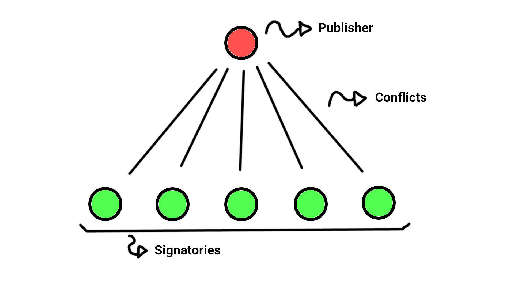
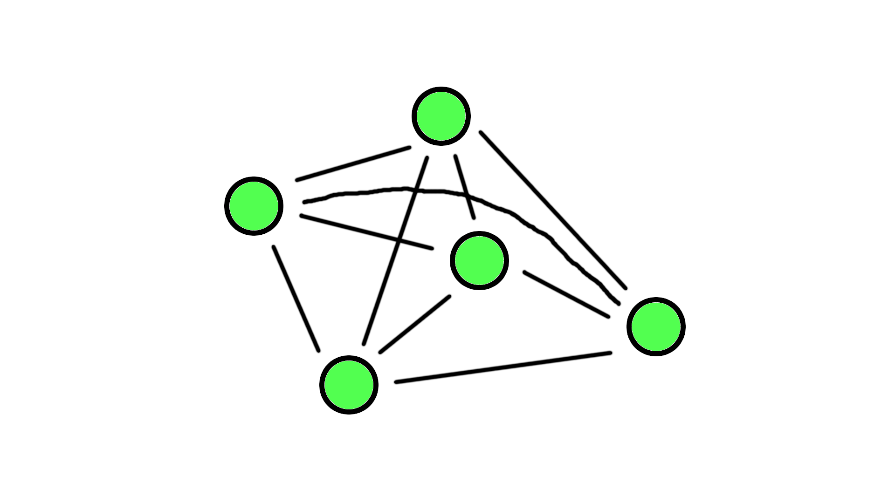

##### [Gabriele] Account datum/Datum/Datums are the same, right ?

# DigiServices
DigiServices is a Cardano-based project that aims to be a trustworthy,
reward-driven platform for goods and service exchanges by allowing users to
create and sign digital contracts. These contracts are written in a special
format which avoids ambiguity and misinterpretation by not relying completely on
natural language.

## Table Of Contents

## Documentation

### Account
An account is a script containing information about the user and also containing
his SIG tokens, which are tokens that represent someone's signature. The script
constraints are defined in such a way that if a script contains someone's SIG
token, you can be sure that this person agreed with the script, or, in our
specific case, agreed with the contract.

Accounts serve as a central place where all platform fees can be collected (SIG
tokens are only minted and transfered, validating the account, if the entrance
fee is paid). Additionally, all actions in the platform, such as contract
creation and signing, are validated only by consuming an account script, which,
if validated, will transfer one SIG token to the contract.

#### Account Data

The account data is defined as follows:

```haskell
data AccountDatum = AccountDatum
  { adCAS :: Integer,
    adContracts :: [AssetClass],
    adSigSymbol :: CurrencySymbol,
    adTickets :: PlutusMap.Map TokenName CurrencySymbol
  }
  deriving (Prelude.Show, Generic, FromJSON, ToJSON, Prelude.Eq)
```

##### adCAS
`adCAS` is the user's credit assessment system (CAS) score. A higher score should
indicate that the user is more trustworthy. At the way it is defined right now,
though, it has almost no purpouse, since an attacker could create a number of
accounts and sign false contracts with them as participants, artificially
increasing his score.

Though this would mean that the attacker would have to repeatidily pay entrance
fees, with the platform growth there could be a market incentive for people to
buy "trustworthy" accounts, making those attacks profitable. To avoid this, our
project will make use of a proof of uniqueness mechanism, in which users that
have CAS scores will need to prove somehow that they have an unique account.


##### adContracts
`adContracts` holds a list of asset classes representing each NFT identifying
a contract the user is part of. This is important so that we can later search
for our contract UTxOs and also so that we can allow or not contracts to affect
our account datum by making sure they are in our list.

##### adSigSymbol
`adSigSymbol` is currency symbol of the SIG token.

##### adTickets
##### [Gabriele]  each ticket corresponds to an action, which in turn mint a token

`adTickets` is a map, matching ticket names to their currency symbols. The
account should only validate if at least one ticket is present in the output.
This is done so that the heavy validation logic occurs outside the script in the
minting policy, making the validator much lighter and the transaction size
smaller.

#### Create Account
Each action is handled by a minting policy, in this case an account is created
if the SIG minting policy mints an equivalent of 100 SIG tokens and transfers
them to the account validator, creating a new UTxO, which will be used to handle
all platform transactions by this user.

##### [Gabriele] a UTxO can be used only once -> please expand


In order to create an account the following must be met:

##### Signature
The transaction must be signed by the public key hash of the token name that is
being minted.

##### Minting
An exact amount of 100 tokens must be minted, all of which should have the token
name corresponding to a representation of the signer's public key hash.

##### Account value
The account should receive the entrance fee, which will then be collected by
the parties responsible for mantaining the platform.

##### Account datum
The datum must contain an intial CAS score of 60,000, an empty list of
contracts, the currency symbol from the minting policy we are using and the
tickets received in the create account parameters.

### Contract

A contract is a script that holds each signatory collateral and handles
conflicts between any two parties. Signing a contract means tranfering a SIG
token to a contract validator.

#### Contract Data

The contract data is defined as follows:

```haskell
data ContractDatum = ContractDatum
  { cdRelationType :: RelationType,
    cdPrivacyType :: PrivacyType,
    cdPublisher :: PubKeyHash,
    cdCollateral :: Value, -- Must be positive
    cdTerms :: PlutusMap.Map Trigger Action,
    cdJudges :: [Address],
    cdAccusations :: [Accusation],
    cdRoles :: Integer, -- The maximum role index
   
###### [Gabriele]  -- The maximum role index [???]
    
    
    cdRoleMap :: PlutusMap.Map PubKeyHash Integer
  }
  deriving (Prelude.Show, Generic, FromJSON, ToJSON, Prelude.Eq)
```

#### Relation Types
Contracts can differ in terms of how parties are treated and how they interact
with each other. They can be of two types:

##### Convergent
Even though there may be multiple parties (20 users, for example), these parties
don't interact with each other (they cannot accuse each other), but they can all
raise disputes against the contract creator. This model is useful for
freelancers, for example, whose clients (which may be many) don't care about
each other, but only care if the service is delivered or not.



##### Distributed
Distributed contracts are different. Although each party may have a different
role, which may alter it's rules, all parties are able to raise disputes against
each other. This type is ideal for clubs, for example, whose members all could
be involved in a distute with each other.



`RelationType` is defined as:

```haskell
data RelationType = RT_Convergent | RT_Distributed
  deriving (Prelude.Show, Generic, FromJSON, ToJSON, Prelude.Eq)

PlutusTx.unstableMakeIsData ''RelationType
PlutusTx.makeLift ''RelationType
```

#### Privacy Types

In addition, contracts can also differ in who is allowed to sign them. Private
and public contracts only differential is that private contracts require
"invites", while public ones do not.

`PrivacyType` is defined as:

```haskell
data PrivacyType = PT_Public | PT_Private
  deriving (Prelude.Show, Generic, FromJSON, ToJSON, Prelude.Eq)

PlutusTx.unstableMakeIsData ''PrivacyType
PlutusTx.makeLift ''PrivacyType
```

#### Publisher
Publisher is the public key hash from the person who created the contract.

#### Collateral
Collateral is the value a user must store inside the contract in order to be
part of it. It may be partially or fully lost if a user does not follow the
terms.

#### Terms
Terms are a series of triggers that, based on the inputs provided by the judges,
may trigger different actions.

##### Triggers
Triggers, if compared to conventional contracts, are the terms. Triggers make
use of the inputs to form conditions that will **trigger** certain actions.

It is defined as follows:

```haskell
data Trigger = TrigEqualsInt IntegerInput Integer
             | TrigEqualsBool BoolInput Bool
             | TrigGreaterThan IntegerInput Integer
             | TrigLessThan IntegerInput Integer
             | TrigNot Trigger
             | TrigAnd Trigger Trigger
             | TrigOr Trigger Trigger
  deriving (Prelude.Show, Generic, FromJSON, ToJSON, Prelude.Eq)

PlutusTx.unstableMakeIsData ''Trigger
PlutusTx.makeLift ''Trigger
```

##### Inputs
Inputs are variables that will be used by the logic condition in order to
trigger certain actions. They are questions that connect the real world (which
is messy and subjective) to the blockchain. Because some questions are specific
to some roles, the input also receives a list of roles to which they apply
exclusively.

Inputs are defined as follows:

```haskell
data BoolInput = BoolInput
  { biRoles :: [Integer],
    biQuestion :: BuiltinByteString
  }
  deriving (Prelude.Show, Generic, FromJSON, ToJSON, Prelude.Eq)

PlutusTx.unstableMakeIsData ''BoolInput
PlutusTx.makeLift ''BoolInput

data IntegerInput = IntegerInput
  { iiRoles :: [Integer],
    iiQuestion :: BuiltinByteString
  }
  deriving (Prelude.Show, Generic, FromJSON, ToJSON, Prelude.Eq)

PlutusTx.unstableMakeIsData ''IntegerInput
PlutusTx.makeLift ''IntegerInput
```

##### Actions
Actions are consequences that must happen in order to resolve a dispute. Actions
can be on-chain or off-chain. The former are those which can be enforced by the
contract it self. For instance, lowering the user CAS score or transfering part
of his collateral.

The latter are those that need to be enforced by the interested parties in real
life. A token is created with the hash of a JSON that contains all information
regarding the case, including the actions that must be done in order to punish
the guilty user. This token can, then, be used by the injured part in order to
ask for real-life punishments.

##### [Gabriele]  ' real-life punishments' -> do you mean to use it to go to court ? How is the legal procedure ? I cannot figure it out


#### Judges
Judges are addresses that will be responsible for determining the inputs, which
will be used to trigger dispute resolution actions. These addresses may be from
human users or from scripts, meaning someone could, for example, replicate the
Kleros court system in Cardano and use it's address as a judge.

##### [Gabriele] how can a judge use the 'adress' of Kleros in Cardano ?


**TODO:** What should happen if a judge "disappears"? Some contracts may be
present for years
##### [Gabriele] a judge must indicate a time frame to proceed to next step. If he fails w/o reasons, collateral he stacked will be affected (penalty). If he fails a new judge to take over, having at disposal all previous investigation, inputs records

**TODO:** What if we have five disputes at the same time? Should the same judge
mediate all of them? ##### [Gabriele] yes

**TODO:** What if a judge never answers? Who sets the deadline? Who should
replace him?
##### [Gabriele] as already set: deadline (24h) set in at smart contract signature, a judge selected at random  from all registered ones, if nobody is in the list or nobody applies as in Kleros

**TODO:** What if there are no more judges available?
##### [Gabriele] we , 3 of us, can initially cover it up as long as additional judges are not registering

#### Accusations
An accusation is a data type the holds the accuser and accused public key hashes,
as well as the time the accusation was sent and the judge that should mediate it.
The contract must store all disputes that have not been resolved yet.

#### Roles
Roles are integers that represent different, well... roles. This means that some
users may be affected by some rules, while other are not. The contract stores
the maximum index, as well as, a map, matching each participant to a role.

##### [Gabriele] why the maximum index is relevant ?

#### Create Contract
Ticket: create-contract

The minting policy should mint a new token "create-contract" and transfer it to
the user account only if the following criteria are met:

##### Contract Datum
The newly created contract datum must be valid, meaning it should:

* Have the publisher corresponding to the account calling this transaction
* Have all inputs with roles less or equal `cdRoles` ##### [Gabriele] not clear


* Have no accusations
* If the contract is private, have a role map with **at least** the publisher role,
otherwise, the role map must **only** have the publisher role.  ##### [Gabriele] not clear

##### Contract Value
The newly created contract should receive the collateral value and the judge
price and one SIG token.

##### Account Datum
The account datum must be equal, except for the addition of the contract to the
list.

##### Account Value
Account value must be equal the original value minus one SIG token. ##### [Gabriele] SIG is transferred to contract

##### Signautre
Must be signed by the account owner.

#### Sign Contract
Ticket: sign-contract

The minting policy should mint a new token "sign-contract" and transfer it to
the user account and the contract account only if the following criteria are
met:

##### Allowed User
If the contract is private, the user must be in the role map.

##### Contract Datum
If the contract is private, the contract datum must be equal. Otherwise, should
only change the role map, with an additional role for the added user. ##### [Gabriele] not clear

##### Contract Value
The newly created contract should receive the collateral value and the judge
price and one SIG token.

##### Account Datum
The account datum must be equal, except for the addition of the contract to the
list.

##### Account Value
Account value must be equal the original value minus one SIG token.

##### Signautre
Must be signed by the account owner.

#### Raise Dispute
Ticket: raise-dispute

The minting policy should mint a new token "raise-dispute" and transfer it to
the contract account only if the following criteria are met:

##### Allowed Dispute
All parties (accuser or accused) must be registered in the role map. If the
contract is convergent, one of the parties must be the publisher. 

##### Contract Datum
The contract datum must be equal, but with an additional accusation.

##### Contract Value
The contract value must be equal.

##### Signautre
Must be signed by the accuser.

#### Resolve Dispute
Ticket: solve-dispute

The minting policy should mint a new token "solve-dispute" and transfer it to
the contract account only if the following criteria are met:

##### Actions completed
If there were on-chain actions, such as platform expulsion, CAS decrease,
collateral consumption, they should be executed. If there were off-chain actions,
a token should be minted with the hash of the JSON indicating the resolution
info. This JSON should be stored by the winning party and he should be able to
require some real life punishment by displaying the minted token and the JSON.

##### Contract Datum
The contract datum must be equal, but the accusation resolved should be
removed.

##### Contract Value
The contract value must be the same minus the collaterals that were consumed
and the SIG tokens from those expelled.

##### Account Datums
The account datums must be equal, except for the removal of the contract from the
list, if it is an account from an expelled person or for the decrease in the CAS
score if such an actions was triggered.

##### Account Values
Account values must be equal the original value plus one SIG token if it was an
account from an expelled user.

**TODO:** If a user loses collateral, wouldn't he need to be automatically
expelled, since he doesn't have sufficent collateral anymore? This doesn't look
ideal.

##### [Gabriele] when collateral is staked at account registration the amount is set to be sufficiently high, e.g. 200 ADA. if a contract requires a higher amount, say 500 ADA, the user / publisher need to add 500 ADA -> 700 ADA stacked, before signing a contract

##### Signautre
Must be signed by the judge responsible for this accusation.
