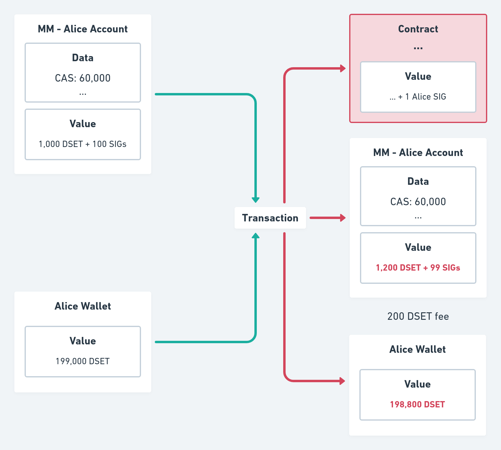
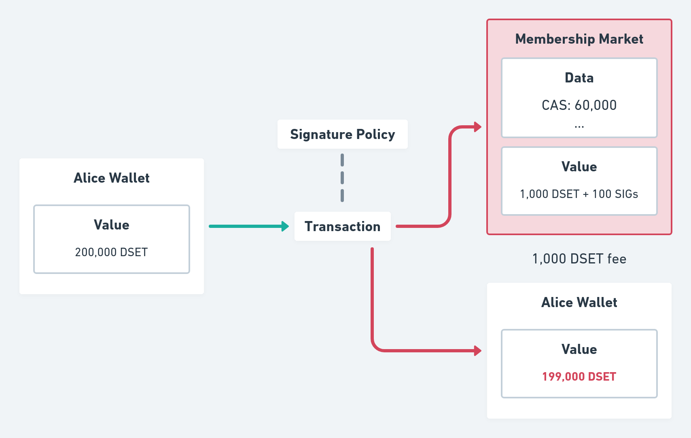

# DigiServices
DigiServices is a Cardano-based project that aims to be a trustworthy,
reward-driven, platform for goods and service exchanges

## Table of Contents
* [Tokenomics](#tokenomics)
  * [Supply](#supply)
* [Alice and Bob example](#alice-and-bob-example)
* [White Paper](#white-paper)

## Tokenomics

### Supply

Differently from traditional currencies, such as Bitcoin, Litecoin and Ethereum,
DigiServices tokens (DSET) are not deflationary. This is important in order to
incentivise cooperative and honest behaviour in the platform.

A fixed amount of DSET tokens is monthly minted and distributed according to a
Credit Assesment System (CAS). Users receive tokens proportionally to their
scores, obeying the following function:

```haskell
-- The total amount of tokens that will be minted every month
totalAmt :: Int
totalAmt = 1000

-- Review is an integer between 0 and 100
calculateRewards :: [Review] -> [Int]
calculateRewards [] = []
calculateRewards (x:xs) = ((x `div` revSum) * totalAmt `div` 100) : calculateRewards xs
  where
    revSum :: Integer
    revSum = sum xs
```

### Distribution

**Need development**

### Utility

In order to ensure that dishonest parties are penalised, DigiServices makes it
possible for service providers to lock an arbitrary amount of tokens inside
their proposal in the marketplace and require that their client do the same. In
this way, not only both know that each other is sufficiently honest to have this
amount of tokens, but they can also use it as a pledge in case there is a conflict.

In this sense, DSET utility is to provide a good measure of honesty inside the
platform and ensure parties are not violated, as well as, possibly in the
future be used as a voting mechanism to ensure decentralisation in the platform.

### Network

Because users receive rewards for being active, inviting new members and
mantaining a good reputation, the network is benefited as a whole. Not only does
DSET creates a viable way of classifying someone's honesty, but it also
incentivises constant use of the platform and good services provion.

## Alice and Bob example

Suppose Alice want’s to offer her services as a writer. In normal circunstances
she could search for a publishing company and sign a contract with them.
The problem, in this case, is that natural language contracts open doors for
ambiguity and misinterpretation. Additionally, physical contracts do not fit the
requirements of practicallaty and quickness.

Another approach, would be for Alice to access an online website focused on
freelance jobs (e.g. Fiverr or Upwork). In this case, alongside with the
ambiguity and flexibility problems (as these websites usually make use of
pre-made natural language contracts), there could be the possibility of Alice
not delivering the project or even of the client not paying the agreed amount.

To solve these issues, we propose DigiServices: a digital platform that, by
making use of Cardano smart contracts, enables parties to offer their services
in a trustfull manner avoiding misinterpratation or ambiguity and using a
reputation system that penalizes dishonest parties and reward honest ones.

Simmilarly to the second example, with DigiServices Alice would be able to
access a user-friendly web application and publish her service there. One of the
key differences, though, would be that this service would not be stored inside a
centralized database, but, rather, inside the Datum of a Plutus Validator called
marketplace.

The Datum of the marketplace contains a list of `Service`s. `Service` is a special
data type that holds four values: A `Title`, a `Description`, a `Price` and a
`Signature` symbol.

The first value (title) is the service Alice will provide (e.g. "Novel writer").
The second value (description) can contain a little bit of her background
and should provide a nice explanation of what she will do (only for marketing
reasons since it shoudn't affect the judge decision in case of a conflict). The
third value (price) is the amount of DSET tokens the client should pay in order
to receive the service.

The last value (signature) is a non-fungible token that is only valid if it
contains a cryptographic signature resulted from the combination of the owner’s
private key and the `Accusation Contract` validator hash.

Example
```haskell
import Ledger

-- Defined explicitily for clarity
signAccusation :: Ledger.Crypto.PrivateKey -> Ledger.ValidatorHash -> Signature
signAccusation pk vh = Ledger.Crypto.sign vh pk

-- This will be stored in the Signature NFT metadata
data Sig = Sig { signatory          :: Ledger.PubKeyHash
               , accusationContract :: Ledger.ValidatorHash
               , signature          :: Signature
               } deriving (Eq, Show)
```

This means that the signature can be used to prove someone agreed with a
determined contract.

In our example, Alice would first create an accusation contract. Let’s suppose
she uses Charlie, Daniel and Emma public keys as the list of judges.
Additionally, let’s say the inputs are `“Was a book actually written and
delivered?”`, `“Did it have more than 200 pages”` and `“Was the
client collaborative, providing any information needed?”`. Lastly, let’s
say the logic written was the following:

```haskell
type ClientTokens = Int
type ProviderTokens = Int
type JudgeTokens = Int

type TTDistribution = (ClientTokens, ProviderTokens, JudgeTokens)
type TotalAmount = Int

distributeTokens :: Bool → Bool → Bool -> TotalAmount → Distribution
distributeTokens inp1 inp2 inp3 totalAmt =
    | (not inp1 || not inp2) && inp3 = ((totalAmt - judgeAmt), 0, judgeAmt)
    | inp1 && inp2 && not inp3 = (0, (totalAmt - judgeAmt), judgeAmt)
    | otherwise = (0, 0, judgeAmt)
  where
    judgeAmt :: Int
    judgeAmt = totalAmt `div` 20
```

Bob could then, agreeing with the contract and seeing that Alice's judges are
reliable and qualified, decide to actually request her services. For that
he would need to provide his signature token and lock the same amount of trust
tokens provided by Alice, as well as, the amount of DSET Alice set as her
service price.

Supposing Alice is rebellious, though, and decide's to write a book with only
100 pages (contrary to the rules she herself defined), Bob could invoke an
"Accuse" event inside the accusation contract, which would notify the first
judge in the list (Charlie) and give him a hardcoded fixed deadline (e.g. 24h)
to provide answers to the inputs defined by Alice ("Was a book actually...").

If he does, then the logic will be executed according to the inputs provided
(e.g. `(True, False, True)`) and would distribute the tokens accordingly.
Because of how the contract was defined, Alice would receive nothing, Bob 57 TT
and Charlie 3 TT. It is possible, though, that Charlie does not respond within
the deadline. In this case, the next judge in the list will be notified and the
cycle repeat.

Of course, in our example Bob was the one to invoke the accusation, but nothing
stops Alice to do the same in case Bob is not cooperative and does not follow
the agreed rules. DigiServices, therefore proves to be a great way of making
sure contracts are followed, eliminating ambiguity normally attached to natural
language contracts and providing the ease of use so valued in our current world.

## White Paper

### White Paper Table of Contents
1. [Problem Statement](#1-problem-statement)
2. [Solution](#2-solution)
3. [Implementation](#3-implementation)
    * [Membership](#a-membership)
    * [Contracts](#b-contracts)
    * [Service](#c-service)
    * [Accusation](#d-accusation)
    * [Trials](#e-trials)
    * [Rewards and Penalties](#f-rewards-and-penalties)
4. [Business Plan](#4-business-plan)
5. [Tokenomics](#5-tokenomics)
6. [Future Direction](#6-future-direction)
7. [Conclusion](#7-conclusion)

### Abstract
Global gig-economy transactions are forecast to grow by 17% a year to around $455 billion dollars by 2023, according to a report from Mastercard [1]. There is a growing need for a fast, secure, and reliable way to establish trust between participants in the gig economy. We propose a platform that enables parties to create contracts stored in the Cardano blockchain to build trust based on token rewards calculated through an algorithm that collects statistics related to the service or good provided and returns the amount of tokens per hour that will be rewarded. Parties that violate the contract will be penalized by losing tokens proportional to the severity of violation.

### 1. Problem Statement

The internet 2.0 revolution started end of the nineties solved a wide range of problems and vastly increased economic efficiency. But this revolution did very little to modernize our legal systems, which have not kept pace with technological and economic progress. Non-Payment and Non-Delivery Crimes show an exponential growth and accounted in year 2020 for $265 million dollar losses in the United States only [2]. In general cyber crimes are sky-rocketing to level still hard to foresee.

In addition to the unfairness of our legal system, bureaucracy and regulations make the process very slow and expensive. This means that, in some cases, people prefer not to invoke any lawsuits even when they are wronged. Even though private mediators appear to provide a solution, they are often very expensive, making them unsuitable for simple services.

Additionally, all these options rely on natural language contracts, which inherit a series of problems, such as subjectivity and complexity. The former can result, a lot of times, in unfair decisions and misunderstanding. The latter make's expensive lawyers required for the creation of a contract. Both of which are not desirable in a legal system that aims fairness and openness.

**Mateus' comment**

I think we could add more details to this first section

### 2. Solution

The solution proposed by DigiServices aims to overcome the limits of physical contracts. Misinterpretation due to subjective language and the innate lack of easy-handling make them useless to tackle the issue. DigiServices is a platform that enables parties to create contracts stored in the Cardano blockchain and builds members trust based on token rewards and penalties, supported by a Credit Assessment System (CAS) able to address every platform member. Additionally a reward-penalty system is in place. An algorithm collects statistics related to the service transactions, credit score, activities and returns the amount of tokens that will be rewarded. Parties that refuse to follow the rules already pre-defined in the contract will be penalized by losing tokens proportionally to the severity of their violation. In extreme cases access to the platform will be suspended.

**Mateus' comment**

"In extreme cases access to the platform will be suspended."
Unless we implement an identification mechanism, I don't think this is possible.

By integrating real-world reliable inputs with strict on-chain contracts, DigiServices aims to mitigate the ambiguity so common in natural-language written contracts, while still preserving the flexibility needed to communicate with the real world. Likewise, we propose an easy-to-use platform by making the creation of contract templates possible. In this way, no expensive lawyers will be required in order to write a contract. Further, mediators, service providers and clients trust will be measured based on a review system powered by the use of DSET tokens that represent scores. This system, together with other components, will be used to determine an user's annual reward. Lastly, DigiServices will target freelancers by having a "service marketplace", where users can provide information about the service they offer and attach it to an "accusation contract", which will be used to handle conflicts.

DigiServices strive for Trustworthy Platform excellence and for this purpose implements strict policies to support just behavior and strongly penalize failures in fulfilling set agreements. In order to provide a great user experience as well as offer an affordable, fast and fair mediation platform, we understand that, above all, four components are important.

#### A. Ease of Use
Users should be able to create Smart Contracts in a few clicks, assisted also by an advanced interactive drag and drop editor. Furthermore, contract templates should provide an easy way to offer services that don't require much flexibility.

#### B. Accessible prices
Anyone will have access to contract templates. This templates will enable users to create contracts for an affordable price or even, in some cases, for free. In addition, the only requirement for opening a service will be a one-time small fee used to support the platform, as well as, avoid membership spam attacks.

#### C. All In-Platform
From the creation of smart legal contracts to the negotiation of clauses and the dispute resolution system, all will be handled through DigiServices using the Cardano platform, making the process much easier and simpler.

#### D. High Customization
DigiServices will allow users to build flexible and versatile smart legal contracts for any need by making use of ready made templates, clauses and logical flows, as well as, letting the users write their own contracts and templates.

### 3. Implementation

#### A. Membership
In order to make someone's trustworthiness easily accessible, DigiServices makes use of a "membership" logic. This membership will be necessary in order to offer, request or mediate services. It offers a way of measuring trust by giving each user a CAS score, which can increase or decrease based on multiple factors, such as user reviews and activity.

An initial registration fee in DSET is required to assure commitment. The registration allow access to all tools and platform services. The initial CAS score will be 60 in a range from 0 to 100, and it will be all parties’ task to increase it to higher levels. At the initial stage the deposited Trust Token will be the most critical factor to appeal the counter-party and build trust. After few transactions the additional CAS elements will enter into play. All members are allowed to link their profile to related sites to show their achievements, skills in the specific field. Trust is, therefore, measured by analyzing someone's CAS score, amount of deposited trust tokens (in the contract) and profile information.

In order to "create an account" in the platform, DigiServices makes use of a "signature policy" script, responsible for minting SIG tokens, which are important for three reasons:

##### I. UTxO Identity
Because anyone can send tokens to an UTxO and set any arbitrary data, there needs to be a way of "officiating" UTxOs and avoid "ghost accounts" or data manipulation. A naive approach would be to create a single NFT and use that to identify the "official" UTxO, the problem would be that concurrency would be lost since all users would only have access to a single UTxO and, since Cardano doesn't allow double spending, two users wouldn't be able to join the platform at the same time.


To solve that, DigiServices makes use of SIG tokens, which can only be minted when certain conditions are met (including the payment of the entrance fee) and are uniquely matched to each user by making the "Token Name" the user's public key hash. This serves as an UTxO "stamp", which can later be checked in order to create a list of valid "accounts". It also allows concurrency since each user has a unique UTxO even though the logic and address are the same.

##### II. Account Identity
Since SIG token names are public key hashes, they also serve as a way to identify users. CAS scores inside accounts that have SIG tokens can be recognized as real and other scripts that may require certain credentials can consume this account UTxO in order to verify if conditions are met.



##### III. Prove compliance
Because DigiServices is a mediation platform, it is extremely important to have a way of proving a user agreed with certain rules. SIG tokens can be used for that purpose since they can only be minted by the user whose public key hash is in the token name. In this way, when smart digital contracts are created, the account output is consumed and a SIG token is locked, proving compliance.



In the underlying protocol, membership will work by creating an "account" (represented by the Membership Market UTxO) using a "membership signature" minting policy. This minting policy will mint 100 new SIG tokens and deposit them in the newly created user "account" (a script validator that handles service offers and requests) provided that it also receives the entrance fee (in the example 1,000 DSET).

#### B. Contracts
So as to achieve objectivity, DigiServices' contracts are represented as a Plutus validator script. It can have multiple states as well as receive multiple redeemers.

The "Default" state indicates that the contract has not been created yet, but the logic is already there, since it's defined in the moment of the UTxO creation. The "Waiting Client" state in the other hand, indicates that the service was already provided and the contract was already signed by the service provider, but there is no "client" yet.

