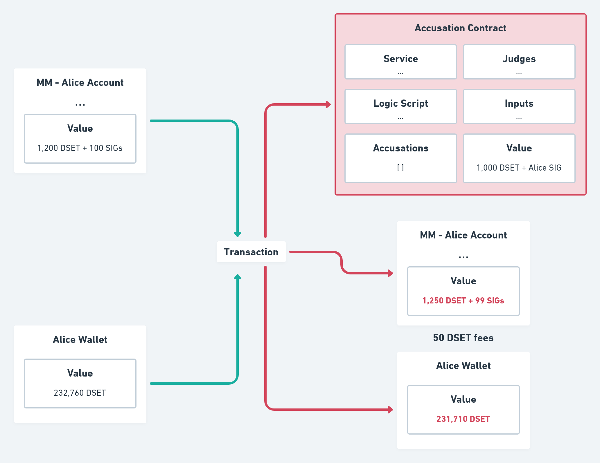
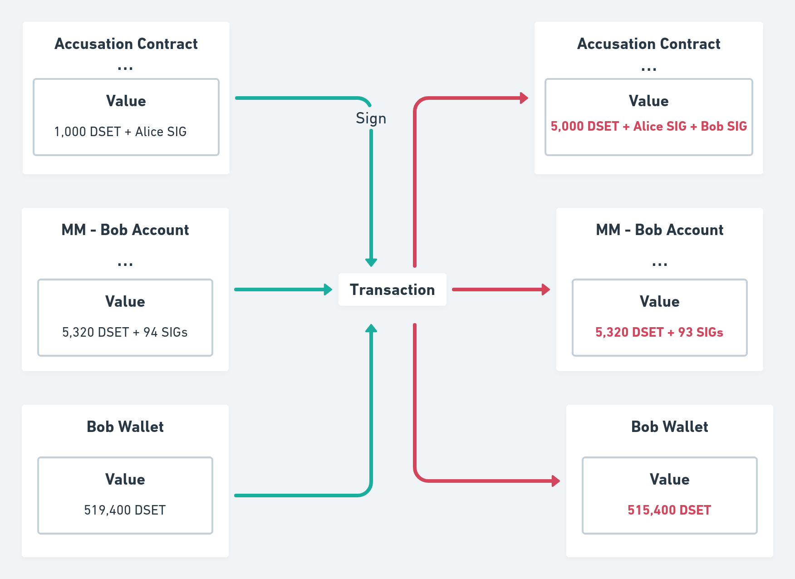

# DigiServices
DigiServices is a Cardano-based project that aims to be a trustworthy,
reward-driven, platform for goods and service exchanges

## Table of Contents
* [Tokenomics](#tokenomics)
  * [Supply](#supply)
* [Alice and Bob example](#alice-and-bob-example)
* [White Paper](#white-paper)

## Tokenomics

### Supply

DigitalServices tokens (DSET) are not inflationary. 

A fixed amount of DSET tokens is minted monthly and distributed according to a *Credit Assessment System* (CAS). Users receive tokens based on their scores obeying the following function:

```haskell
-- The total amount of tokens that will be minted every month
totalAmt :: Int
totalAmt = 1000

-- Review is an integer between 0 and 100
calculateRewards :: [Review] -> [Int]
calculateRewards [] = []
calculateRewards (x:xs) = ((x `div` revSum) * totalAmt `div` 100) : calculateRewards xs
  where
    revSum :: Integer
    revSum = sum xs
```

### Distribution

**Need development**

### Utility

DSET can be used as utility tokens to enforce honest behavior between parties. Service providers and their clients are able to lock an arbitrary amount of tokens inside their agreement to incentivize honest behavior. In the event of a conflict, one possible resolution is to punish the dishonest party by transferring these locked tokens to the honest party.

In the future, DSET tokens may also be used as a voting mechanism to ensure decentralisation in the platform.

### Network

Users receive rewards for being active on the platform. Inviting new members and maintaining a good reputation benefits the network. DSET creates a viable way to classify someone's honesty and are distributed as rewards to users of the platform providing goods and services.

## Alice and Bob example

Suppose Alice want’s to offer her services as a writer. Traditionally,
she would search for a publishing company and sign a contract with them.
The problem with this approach is that natural language contracts open doors for
ambiguity, misinterpretation, and do not fit the requirements of practicality and quickness.

Another approach, would be for Alice to access an online website focused on
freelance jobs (e.g. Fiverr or Upwork). These sites usually use pre-made natural language contracts. This approach suffers from the same problems of natural language contracts mentioned above and have the additional risk of the project not being delivered or the client not paying the agreed amount.

To solve these issues, we propose DigiServices: a digital platform that allows service providers and clients to engage in honest transactions without the parties needing to trust each other. Built on Cardano, it uses smart contracts to enable parties to offer their services without the possibility of misinterpreation or ambiguity. It uses a reputation system to penalize dishonest parties and reward honest parties.

With DigiServices, when Alice publishes her service online, it will be stored inside the Datum of a Plutus Validator called *marketplace*. The Datum of the contains a list of `Service`s. 
`Service` is a special data type that holds five values: 
- `Title`
   - the name of the service Alice will provide (e.g. *Novel Writer*)
- `Description`
   - provides context such as Alice's background and allow Alice to market service 
- `Price`
   - amount of DSET tokens the client will pay to receive the service
- `Trust`  is the Trust Token amount, deposited by the service provider at each service contract deal 
- `Publisher` is the member public key hash

Example
```haskell
import Ledger

-- Defined explicitily for clarity
signAccusation :: Ledger.Crypto.PrivateKey -> Ledger.ValidatorHash -> Signature
signAccusation pk vh = Ledger.Crypto.sign vh pk

-- This will be stored in the Signature NFT metadata
data Sig = Sig { signatory          :: Ledger.PubKeyHash
               , accusationContract :: Ledger.ValidatorHash
               , signature          :: Signature
               } deriving (Eq, Show)
```

This means that the signature can be used to prove someone agreed with a
determined contract.

In our example, Alice would first create an `Accusation Contract`.

She uses Charlie, Daniel and Emma public keys as the list of judges.

She uses the following inputs to create the contract:
  - `“Was a book actually written and delivered?”`
  - `“Did it have more than 200 pages”`
  - `“Was the client collaborative, providing any information needed?”`
  
The logic is codified below.

```haskell
type ClientTokens = Int
type ProviderTokens = Int
type JudgeTokens = Int

type TTDistribution = (ClientTokens, ProviderTokens, JudgeTokens)
type TotalAmount = Int

distributeTokens :: Bool → Bool → Bool -> TotalAmount → Distribution
distributeTokens inp1 inp2 inp3 totalAmt =
    | (not inp1 || not inp2) && inp3 = ((totalAmt - judgeAmt), 0, judgeAmt)
    | inp1 && inp2 && not inp3 = (0, (totalAmt - judgeAmt), judgeAmt)
    | otherwise = (0, 0, judgeAmt)
  where
    judgeAmt :: Int
    judgeAmt = totalAmt `div` 20
```

Bob could read Alice's contract and if he agrees with Alice's inputs, could also determine if the judges Alice selected are reliable and qualified to fairly handle a conflict before requesting Alice's services.

To request Alice's services, Bob would provide his signature token and lock the same amount of DSET tokens provided by Alice in the `Accusation Contract` plus the amount of DSET tokens to pay Alice for her services.

Lets assume Alice violates the contract and only delivers a book with 100 pages. Bob could invoke an "Accusation" event inside the `Accusation Contract`. This will notify the first judge in the contract (Charlie) and give him a hardcoded fixed deadline (e.g 24 hours) to provide answers to the inputs defined by Alice.

If he does, then the logic will be executed according to the inputs provided (e.g. `(True, False, True)`) and would distribute the tokens locked in the `Accusation Contract` accordingly. Because of how the contract was defined Alice would receive nothing. Bob would receive 57 trust tokens (TT) and Charlie would receive 3 TT. It is possible that Charlie does not respond within the deadline. In this case the next judge in the list will be notified and the cycle repeats.


In our example Bob was the one to invoke the accusation, but Alice
could do the same thing if Bob does not follow the agreed upon rules in the contract. 

This example illustrates one possible way that DigiServices can be used to establish trust between two parties who do not know each other by eliminating ambiguity normally attached to natural language contracts and provide a way to resolve conflicts.
## White Paper

### White Paper Table of Contents

[Abstract](#Abstract)
1. [Problem Statement](#1-problem-statement)
2. [Solution](#2-solution)
3. [Governance](#3-governance)


4. [Implementation](#3-implementation)
    * [Membership](#a-membership)
    * [Contracts](#b-contracts)
    * [Accusation](#c-accusation)
    * [Trials](#d-trials)
    * [Rewards and Penalties](#e-rewards-and-penalties)
5. [Business Plan](#4-business-plan)
6. [Tokenomics](#5-tokenomics)
7. [Road Map](#6-Road Map)
8. [Future Direction](#7-future-direction)
9. [Conclusion](#8-conclusion)

### Abstract
Global gig-economy transactions are forecast to grow by 17% a year to around $455 billion dollars by 2023, according to a report from Mastercard [1]. There is a growing need for a fast, secure, and reliable way to establish trust between participants in the gig economy. We propose a platform that enables parties to create contracts stored in the Cardano blockchain to build trust based on token rewards calculated through an algorithm that collects statistics related to the service or good provided and returns the amount of tokens per hour that will be rewarded. Parties that violate the contract will be penalized by losing tokens proportional to the severity of violation.

### 1. Problem Statement

The internet 2.0 revolution started end of the nineties solved a wide range of problems and vastly increased economic efficiency. But this revolution did very little to modernize our legal systems, which have not kept pace with technological and economic progress. Non-Payment and Non-Delivery Crimes show an exponential growth and accounted in year 2020 for $265 million dollar losses in the United States only [2]. In general cyber crimes are sky-rocketing to level still hard to foresee.

In addition to the unfairness of our legal system, bureaucracy and regulations make the process very slow and expensive. This means that, in some cases, people prefer not to invoke any lawsuits even when they are wronged. Even though private mediators appear to provide a solution, they are often very expensive, making them unsuitable for simple services.

Additionally, all these options rely on natural language contracts, which inherit a series of problems, such as subjectivity and complexity. The former can result, a lot of times, in unfair decisions and misunderstanding. The latter make's expensive lawyers required for the creation of a contract. Both of which are not desirable in a legal system that aims fairness and openness.

**Mateus' comment**

I think we could add more details to this first section

### 2. Solution

The solution proposed by DigiServices aims to overcome the limits of physical contracts. Misinterpretation due to subjective language and the innate lack of easy-handling make them useless to tackle the issue. DigiServices is a platform that enables parties to create contracts stored in the Cardano blockchain and builds members trust based on token rewards and penalties, supported by a Credit Assessment System (CAS) able to address every platform member. Additionally a reward-penalty system is in place. An algorithm collects statistics related to the service transactions, credit score, activities and returns the amount of tokens that will be rewarded. Parties that refuse to follow the rules already pre-defined in the contract will be penalized by losing tokens proportionally to the severity of their violation. In extreme cases membership access to the platform will be suspended.

**Mateus' comment**

"In extreme cases access to the platform will be suspended."
Unless we implement an identification mechanism, I don't think this is possible.
**Gabriele's comment**
You are right. I changed into 'membership access' . In such as case all membership account own assets, such as DSET are burnt. Of course the member can still register again to the platform. This is one of draw-backs of anonimity, but I think membership access fees can partially prevent abuses.


By integrating real-world reliable inputs with strict on-chain contracts, DigiServices aims to mitigate the ambiguity so common in natural-language written contracts, while still preserving the flexibility needed to communicate with the real world. Likewise, we propose an easy-to-use platform by making the creation of contract templates possible. In this way, no expensive lawyers will be required in order to write a contract. Further, mediators, service providers and clients trust will be measured based on a review system powered by the use of DSET tokens that represent scores. This system, together with other components, will be used to determine an user's annual reward. Lastly, DigiServices will target freelancers by having a "service marketplace", where users can provide information about the service they offer and attach it to an "accusation contract", which will be used to handle conflicts.

In order to provide a great user experience as well as offer an affordable, fast and fair mediation platform, we understand that, above all, four components are important.

#### A. Ease of Use
Users should be able to create Smart Contracts in a few clicks, assisted also by an advanced interactive drag and drop editor. Furthermore, contract templates should provide an easy way to offer services that don't require much flexibility.

#### B. Accessible prices
Anyone will have access to contract templates. This templates will enable users to create contracts for an affordable price or even, in some cases, for free. In addition, the only requirement for opening a service will be a one-time small fee used to support the platform, as well as, avoid membership spam attacks.

#### C. All In-Platform
From the creation of smart legal contracts to the negotiation of clauses and the dispute resolution system, all will be handled through DigiServices using the Cardano platform, making the process much easier and simpler.

#### D. High Customization
DigiServices will allow users to build flexible and versatile smart legal contracts for any need by making use of ready made templates, clauses and logical flows, as well as, letting the users write their own contracts and templates.

### 3. Implementation

#### A. Membership
In order to make someone's trustworthiness easily accessible, DigiServices makes use of a "membership" logic. This membership will be necessary in order to offer, request or mediate services. It offers a way of measuring trust by giving each user a CAS score, which can increase or decrease based on multiple factors, such as user reviews and activity.

An initial registration fee in DSET is required to assure commitment. The registration allow access to all tools and platform services. The initial CAS score will be 60'000, being the range 0 to 100'000, and it will be all parties’ task to increase it to higher levels. At the initial stage the deposited Trust Token will be the most critical factor to appeal the counter-party and build trust. After few transactions the additional CAS elements will enter into play. All members are allowed to link their profile to related sites to show their achievements, skills in the specific field. Trust is, therefore, measured by analyzing someone's CAS score, amount of deposited trust tokens (in the contract) and profile information.

In order to "create an account" in the platform, DigiServices makes use of a "signature policy" script, responsible for minting SIG tokens, which are important for three reasons:

##### I. UTxO Identity
Because anyone can send tokens to an UTxO and set any arbitrary data, there needs to be a authentication of UTxOs and avoid "ghost accounts" or data manipulation. A naive approach would be to create a single NFT and use that to identify the authentic UTxO; the problem would be that concurrency would be lost since all users would only have access to a single UTxO and, since Cardano doesn't allow double spending, two users wouldn't be able to join the platform at the same time.

DigiServices makes use of SIG tokens to address this issue. SIG can only be minted when certain conditions are met (including the payment of the entrance fee) and are uniquely matched to each user by making the "Token Name" the user's public key hash. This serves as an UTxO "stamp", which can later be checked in order to create a list of valid "accounts". It also allows concurrency since each user has a unique UTxO even though the logic and address are the same.


##### II. Account Identity
Since SIG token names are public key hashes, they also serve as a way to identify users. Each account linked to a SIG token is provided with a CAS score and can be recognized as real; other scripts requiring credentials can consume this account UTxO in order to verify if conditions are met.

##### III. Prove compliance
Because DigiServices is a inter-mediation platform, it is of fundamental importance to have a way of proving a user's agreemeent with set rules. SIG tokens can be used for this purpose, since they can only be minted by the user whose public key hash is contained into the token name. In this way, when smart digital contracts are created, the account output is consumed and a SIG token is locked, proving compliance.


In the underlying protocol, membership will work by creating an "account", represented by the Membership Market (MM) UTxO using a "membership signature" minting policy. This minting policy will mint 100 new SIG tokens and deposit them in the newly created user "account" . This is a script validator that handles service offers and requests, provided that it also receives  in input the entrance fee (in the below example 1,000 DSET).


#### B. Contracts
So as to achieve objectivity and decentralization, DigiServices' contracts are represented as a Plutus validator script. These contracts contain five important components.

##### I. Judges
Judges are essential for the dispute resolution mechanism. If unreliable or incompetent mediators are chosen, there is no guarantee of fairness. Because of this, they should be chosen in the moment the contract is created by the service provider, who should analyze carefully the options displayed in the main application and only choose judges that either have a good reputation or are known by them to be honest. The service provider is encouraged to make good selection as well in order to attract more clients who will in turn, verify the mediators reliability and record to ensure a smooth and just deal.

Since it's open to the service provider to chose whoever he prefers and the judges can be any public key hash registered as a member of the platform, DigiServices opens room for new ways of determining good mediators; for example neural networks could  be trained to identify good options, rank classifications by specialties or even act as actual judges as a next step development. This abstractness and flexibility creates an incentive new projects and ideas to emerge along with  and enriching the ecosystem.

In addition, since judges are rewarded for providing reliable inputs, the platform creates a market around providing trustful data and opens possibilities for new actors and organizations specialized in mediation and arbitration. This is to overcome the current system that does not provide similar monetary incentive to arbitrary judges.

##### II. Inputs
Differently from the conventional idea that judges should decide who is guilty, DigiServices understands that mediators job should only be to provide factual data, since penalties and rewards can be better handled by a objective, deterministic process, which has no bias and is not subjected to ambiguity.

For this reason, inputs act as "yes / no" questions and it is responsibility of the judges to provide reliable answers in form of a boolean (true or false). This inputs are then passed to the arbitrary logic defined by the service provider, which will decide how the previously locked tokens will be distributed.

##### III. Logic
The logic is another validator script defined by the service provider that should receive N "inputs" from the judges as a redeemer, consuming the contract UTxO and should, according to the rules formally defined, distribute the consumed tokens which were locked by both the client and the service provider. Because inputs can be any boolean "questions", users can make sure that dishonest parties are penalized by creating strictly defined rules connected to real-world inputs in form of Plutus script validators. Therefore, the logic itself acts as a judge, deciding who is guilty (less or no tokens) or innocent (receiving more or all tokens).

Nonetheless, it is important to notice that this logic script address may not exist and it is the responsibility of the client to assure that it does and that it has reasonable terms before he signs the contract.

##### IV. Accusations
Accusations is a list of 3-elements tuples containing the accuser and accused public key hash and the mediator deadline `[(AccuserPKH, AccusedPKH, Deadline)]`. 
****Gabriele ->  When this list increases ***(?) 

the responsible judge (the first confirmed mediator from the list) will be notified and is expected to provide the necessary inputs to the logic script before the set deadline.

##### V. Service
Service can be understood as a more general term. Another term to define it could be "Information", since its function is to better formulate what the contract is about and give extra information about the deal as well as define the essential parameters (price and "trust", for example). In this sense, a company wishing to transfer its policies to a decentralized system could represent it as a service and create a new contract to handle conflicts between employees or issues related to their overall work. This contracts could have real world implications if the company decided, for instance, to measure their performance by comparing the number of tokens they own. 

To cover this aspects, services are a data type that hold five parameters:

* Publisher: A public key hash identifying the person who created this service
* Title: A string with a brief description about what the contract is about
* Description: A string with a more in-depth picture about the service
* Trust: The amount of DSET tokens (Trust Tokens) that will be on-hold to act as a guarantee for the case one of the parties breaks the rules
* ContractType: A data type that will indicate of what type this contract is and the specific parameters. It can be `Constant`, which takes no argument or `OneTime`, which takes a `Value` indicating the price and a `POSIXTime` indicating the deadline. 

Finally, the contract is authenticated only if it receives a SIG token as input from the service provider. This is done by consuming the user "account" UTxO provided that the data contains the five essential components.



The contract validator can receive four redeemers: "Open `Integer`", "Close", "Sign" and "Accuse `PubKeyHash`". The open redeemer indicates that, within the limit provided by the integer
***Gabriele -> What is the integer limitation actually ?

, any user can "Sign" this contract and request this service. The close redeemer, in the other hand, signalizes that, from now on, no more clients should be allowed to sign this contract.



At any point in time judges that are inside the list of mediators can choose to "sign" the contract, upon request, providing their membership SIG token to show that they accept to mediate it. They also deposit an amount of tokens; this will be transferred to the damaged parties in case they do not provide a reliable input within the deadline.

#### C. Accusation
In order to accuse someone, any user that has already signed a contract can anytime consume the contract UTxO using the accuse redeemer. This will have as effect an increase into the running diputes amount, the accusation list. A new triple is generated including the user's public key hash, the accused entity and the set deadline. The main application will generate an event and notify the first confirmed judge. At that point the judge, mediator/arbitrator starts acting and provides the inputs as for set logic code. 


#### D. Trials
After a judge has been notified, it is his responsibility to discover as many information as possible concerning the case. In this sense, if necessary, he can call both parties to a discussion in which each one will explaining their views. Lawyers like in the traditional legal system may be engaged as well, if they think is necessary. In most cases, though, it will be sufficient if the judge communicates in digital format with the users and ask them for proofs and defenses, as it is in the best interest of both to collaborate. In this way judges finds out the actual facts assisting an activity of investigation.
After sufficient information has been acquired by the mediator, he can consume the "logic" UTxO providing the set boolean inputs as a redeemer. This Plutus validator will then consume the contract UTxO and distribute the deposited tokens according to the set terms (terms should be understood as the logic itself).


#### E. Rewards and Penalties
DigiServices strive for Trustworthy Platform excellence and for this purpose implements strict policies to support just behavior and strongly penalize failures in fulfilling set agreements.

In that regard, judges, service providers and clients will be rewarded for their service through a weighed formula that will distribute tokens based on their CAS scores every month. In addition, members having scores exceeding a set threshold continuously over 12 months shall receive a premium-reward in DSET. Aiming at increased participation and activity, members will also be able to freely set a minimum transaction quantity threshold (number of deals), measured per month. The higher the value set, the higher the premium-reward.

Penalties will follow a similar approach. Members with low CAS scores will be forced to pay an amount of tokens in order to maintain their membership and, if for 12 consecutive months, their CAS score is below a set threshold, the user will have an extra penalty.

CAS scores can be found in each user account. The signature policy script, which "officiate" accounts, only allows minting of signature tokens if the account UTxO is initialized with a datum containing the initial CAS score (600,000). This ensures that all users start with the same score and no data is tempered. After an account is officiated, it's UTxO will only be consumed when validated, making it possible for the platform to execute the necessary logic, increasing or decreasing users' scores.

The user score increment is defined as a percentage of the subtraction between the total and the actual score. 

***Gabriele -> the calculation example is not clear to me, please expand on it

For instance, if the CAS score increment of a service deal was 10%, a user that has 600,000, would then get a score of 640,000 (+10% of 1,000,000 minus 600,000). Another member with a score of 200,000, in the other hand, would get 280,000. This means that the higher a score is, the harder it is to grow. This ensures balance between users and stimulates members with low scores to try to improve with the additional bonus of creating competitiveness between the top members.

Scores can be increased in the following occasions:

##### I. Service Deals
In order to incentivize constant use of the platform, DigiServices reward's users for service deals. This is done by increasing the user score proportionally to the platform fees paid in the transaction only if there were no accusations and both parties were satisfied. Using fees to calculate the score increase ensures that there is no manipulation since an attacker would need to spend a larger amount of tokens in fees than he could earn in rewards.

##### II. Conflict Resolutions
Another important component of DigiServices is the resolution mechanism: a Plutus validator script that redistributes locked tokens from parties based on the input from trusted judges in order to penalize those who did not follow the established rules. Judges are very important for the sustainability of the platform, since they are the ones responsible for providing reliable connections between the natural world and the blockchain world. As for better evaluating the honesty of platform mediators, judges' CAS scores increase whenever their resolution is not challenged. Their increment is proportional to the price of the service mediated.

***Gabriele ->  please make a numeric example to make the explanation crystal clear


##### III. Reviews
After a service is completed or a conflict is resolved, the involved parties must give a review. Because DigiServices intends to preserve users' anonymity (**Mateus' Comment** That's my opinion, what do you guys think?) and review manipulation would be undesirable, reviews are matched to DSET tokens. Whenever a service is completed, the client and the service provider are forced to distribute 0.5% of the service price, either giving it partially or fully to the other. The remaining is burnt.

(***Gabriele's Comment** I believe anonimity provides added value to the platform as for today. We need to add numerical examples to assure clarity)

For instance, a traditional five stars in DigiServices would mean that the total value (0.5%) was given to the other user (nothing would be burnt) and a two stars review would mean that only a part of the value (0.2%) would be "tipped" and the rest burnt. Additionally, users can provide more than five stars by giving extra tips exceeding the required value.

In the conflict resolution, though, things are a little bit different since reviews from favored parties would be almost always positive and reviews from losing parties negative. As for solving this issue, mediators are reviewed by the other judges from their list.

Because reviews are a good indicator of someone's honesty, participation and competence, they are also responsible for increasing or decreasing a member's CAS score. Following the other approaches, the score is incremented (or decremented) proportionally to the value deposited minus half the maximum possible value (0.25%). Users with less than a 2.5 stars review would, therefore, see a decrease in their CAS score.

A fixed amount of DSET tokens is monthly minted and distributed according to the Credit Assessment System (CAS). Users are rewarded or penalized with tokens proportionally to their scores, obeying the following `calculateRewards` function:

```haskell
-- An alias for Integer that indicates an user CAS score (0 to 100)
type CAS = Integer

-- The total amount of tokens that will be minted every month (just as an example)
totalAmt :: Integer
totalAmt = 1000

initialValue :: Integer
initialValue = 600000

calculateReward :: CAS -> Integer -> Integer
calculateReward score scoreSum
  | scoreSum == 0 = 0 -- Ensure that we are not trying to divide by zero
  | otherwise = ((score - initialValue) * totalAmt) `div` scoreSum

-- The sum of all rewards should be less or equal the total amount of tokens
calculateRewards :: [CAS] -> [Integer]
calculateRewards xs = map (`calculateReward` scoreSum) xs
  where
    scoreSum :: Integer
    scoreSum = foldl (\ acc x -> acc + x - initialValue) 0 xs
```

```bash
Prelude> calculateRewards [1_000_000, 1_000_000, 1_000_000]
[333,333,333]
Prelude> calculateRewards [357_947, 946_792, 649_063]
[-1574,2254,319]
```

As seen, the `calculateRewards` function takes each member CAS score and try to find the proportional amount of tokens to be rewarded or taken. In order to avoid schemes in which users create multiple accounts to receive free rewards, the function subtracts the initial value (600,000) from the user score. This means that it is possible for a member to receive a "negative reward" (or penalty) and be forced to pay the specified amount so that he does not have his membership suspended.       


***6 - Road Map

##Initial Thoughts
The Cardano blockchain is a new third generation blockchain relying on proof-of-stake for throughput and energy efficiency.
As this new ecosystem opens up through Alonzo version by end of year 2021, the users and businesses will be able to operate on this new vast ecosystem.
Digiservices platform draws on Cardano smart contract environment to provide trustworthiness to third parties service providers platform or to services exchanged on the platform itself.
A suitable and engaged partner will be selected for the marketing activity to show how a blockchain solution can provide a cheaper, trustworthy, convenient platform for them, while providing a capability for customers/members to take advantage of Defi, paying with native tokens DSET while allowing swapping between Ada and other popular tokens all hosted on the Cardano network. 

#Roadmap Stages

#Stage 1  - 3 month  - Overall Proof-of-Concept, Sep.-Nov. 2021
-Identify technical issues
-High level concept design
-Visual design options
#Stage 2  - 6 months - Solution, Technical Model, Solution Details, Dec.2021-May 2022
-Concept solution options
-Test concept, Prototype with potential members through new ‘DigiServices’ platform, on Alonzo Mainnet
-Development marketing and uptake plan
#Stage 3 - 2 Months  - Release 1. Version, Jun.2022 – Jul.2022
First go live and working solution for at least 10’000 registered members


