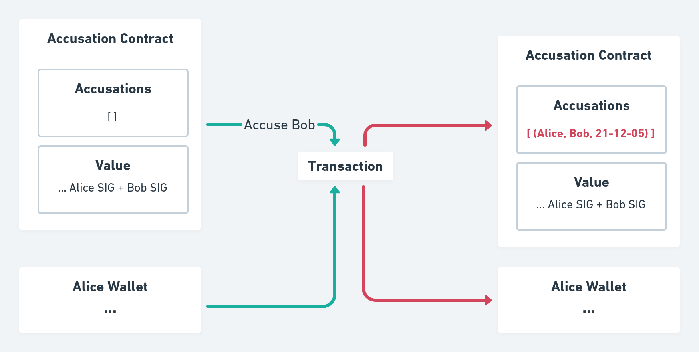
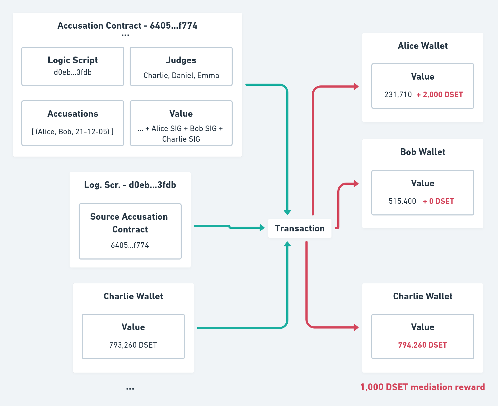
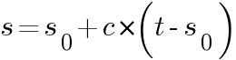
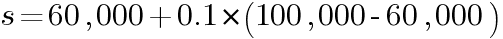

#   White Paper

## DigiServices: A trustworthy platform for signing and mediating formally defined contracts

Samuel Santos Araujo, samuelssan28@gmail.com

Gabriele Castaldi, vareca@live.com, masami03ga@gmail.com

Frank Delpidio, frankdelpidio@gmail.com


### White Paper Table of Contents

[Abstract](#Abstract)

[Team and Project Background](##Team-and-Project-Background)

1. [Problem Statement](#1-problem-statement)
2. [Solution](#2-solution)
3. [Governance and Tokenomics](#3-governance-and-tokenomics)  
    * [Governance](#a-Governance)
    * [Tokenomics](#b-Tokenomics)
    * [Voting](#c-Voting)
    * [Utility token DSET](#d-Utility-token-DSET)
    * [Alice and Bob example](#alice-and-bob-example)
    * [Nature and uses of the DSET Token](#e-Nature-and-uses-of-the-DSET-Token)
4. [Business Model](#4-business-model)
5. [Implementation](#5-implementation)
    * [Membership](#a-membership)
    * [Contracts](#b-contracts)
    * [Accusation](#c-accusation)
    * [Trials](#d-trials)
    * [Rewards and Penalties](#e-rewards-and-penalties)
6. [Scalability](#6-scalability)
7. [Road Map](#7-Road-Map)
8. [Future Work](#8-future-work)
9. [Conclusion](#9-conclusion)
 [Sources](#Sources)

### Abstract
Global gig-economy transactions are forecast to grow by 17% a year to around $455 billion dollars by 2023, according to a report from Mastercard (1). There is a growing need for a fast, secure, and reliable way to establish trust between participants in the gig economy. We propose a platform that enables parties to create contracts stored in the Cardano blockchain to build trust based on token rewards calculated through an algorithm that collects statistics related to the service or good provided and returns the amount of tokens per month that will be rewarded. Parties that violate the contract will be penalized by losing tokens proportional to the severity of violation.

### Team and Project Background
The core team initiating DigiServices is made up by a pool of young enthusiasts attending the Plutus Pioneer Cohort (2).  The team is equipped with previous experience in programming with imperative languages and is going to open to new developers with blockchain programming experience.
Trustworthiness and Legitimacy building are core values to be built-in the forthcoming Cardano-driven platform. We believe that the Most Important Scarce Resource is Legitimacy, and this brings about giant costs (Vitalik Buterin) (3). The Bitcoin and Ethereum blockchain ecosystems both spend far more on network security - the goal of proof of work mining - than they do on everything else combined. The Bitcoin blockchain has paid an average of about $38 million per day in block rewards to miners since the start of the year, plus about $5m/day in transaction fees. The Ethereum blockchain comes in second, at $19.5m/day in block rewards plus $18m/day in tx fees. Meanwhile, the Ethereum Foundation's annual budget, paying for research, protocol development, grants and all sorts of other expenses, is a mere $30 million per year (3).

Willingness to challenge the existing barriers and constraints at today’s service exchange platform such as Upwork and overcome the steeply rising cyber-crime on Non-payments/Non-Delivery risk
The full protocol implementation will require the addition of few developers with advanced Haskell skills as well as a partnership with one or more social platforms to assure visibility and a actual quick proof-of-concept.
                       
### 1. Problem Statement

The Web 2.0 revolution started at the end of the 1990s. It solved a wide range of problems and vastly increased economic efficiency. However, this revolution did little to modernize our legal systems, which have not kept pace with technological and economic progress. Non-Payment and Non-Delivery Crimes show an exponential growth and accounted for $265 million in losses in the United States in 2020 (4). Cyber crimes continue to rise at an increasing rate.

Bureaucracy and regulation make the current legal system slow and expensive. In some cases, people prefer not to invoke any lawsuits even when they are wronged. Private mediators appear to provide a solution, but they are often expensive and unsuitable for simple services.

Natural language contracts also cause a series of problems. Subjectivity can result in unfair decisions and misunderstanding. Complexity requires expensive lawyers to create contracts. Neither of these attributes are desirable in a legal system that aims for fairness and openness.

### 2. Solution

DigiServices aims to overcome the limits of physical contracts by providing a platform that enables parties to create contracts stored in the Cardano blockchain. The platform builds members trust based on token rewards and penalties, supported by a Credit Assessment System (CAS) able to address every platform member. 

The reward-penalty system is an algorithm that collects statistics related to the service transactions, user reviews, and other activities. It returns the amount of tokens that will be rewarded. Parties that refuse to follow the rules defined in the contract will be penalized by losing tokens proportionate to the severity of their violation. In extreme cases membership access to the platform will be suspended.

In such as case all membership account own assets, such as DSET are burnt. Of course the member can still register again to the platform. This is one of draw-backs of anonymity, but membership access fees can partially prevent abuses.

By integrating real-world reliable inputs with strict on-chain contracts, DigiServices aims to mitigate the ambiguity common in natural-language written contracts, while preserving the flexibility needed to communicate with the real world. 

DigiServices proposes an easy-to-use platform to create contract templates. This will eliminate the current need for expensive lawyers to write contracts. Trust between mediators, service providers, and clients will me measured by a review system that is powered by DSET tokens which represent a "trust score". This system, when combined with other components, will be used to determine a user's annual reward.

DigiServices will target freelancers with a *service marketplace*, where users can market their service and attach it to an *accusation contract*, which is used to handle conflicts.

DigiServices has identified four core components to provide a mediation platform that is affordable, fast, fair, and provides a great user experience:
#### A. Ease of Use
Users should be able to create Smart Contracts in a few clicks using an advanced interactive drag and drop editor. Contract templates should provide an easy way to offer services that don't require much flexibility.

#### B. Accessible prices
Everyone will have access to contract templates. These templates will enable users to create contracts for an affordable price, or for free. The only requirement for opening a service will be a one-time small fee which is used to support the platform and prevent membership spam attacks.

#### C. All In-Platform
From the creation of smart legal contracts to the negotiation of clauses and the dispute resolution system, all will be handled through DigiServices using the Cardano platform, making the process easy and simple for the end user.

#### D. High Customization
DigiServices will allow users to build flexible and versatile smart legal contracts for any need by using ready made templates, clauses and logical flows. Users can also write their own contracts and templates for their specific use case.

### 3. Governance and Tokenomics
#### A. Governance
DigiServices governance until the launch stage will be managed by the funding core team. At a later stage, after the membership will have exceeded the 1 million memberships threshold, participants will be able to use their staked DSET to vote on the future direction of the platform.
Token holders, either through direct staking or a delegation system, will then be able to vote on which proposals the network should implement. Rewarding and burning system balance will assure that the DSET circulating amount will be capped at the maximum set level. 

#### B. Tokenomics
The token will have a total supply of 1 billion distributed as follows:

● 10% - Institutional investors 

● 20% - Core Team & Marketing and Developement Partner 

● 70% - Public Sale 

The membership rewarding fund will be supported by 5% of transaction fees. In this way we assure the totally issued DSET tokens amount will be capped at 1 billion units.

#### C. Voting
Voting on the platform will utilize the quadratic voting method (5), whereby voting power of an individual user is proportional to the square root of their investment amount. This method, along with other precautions, prevent so-called 'whale' investors from gaining control of the voting process and denying other users the ability to cast votes.

#### D. Utility token DSET
Blockchain can be used to create decentralized ecosystems in which a token is issued in order to fund and assist the development of an ecosystem and that can be later used to purchase goods /services or being an integral part of a service itself, benefiting from the advantages of a decentralized structure, eliminating or reducing the presence of a central intermediary body, thus
allowing the value shift from the center to the ends.

DigiServices’ vision encompasses this model where the blockchain is used to create a truly decentralized self-sustaining ecosystem. DigiServices strongly believes that the future of the internet lies in services powered by utility tokens, improving existing services with new paradigms that cannot be achieved in the absence of a distributed ledger.

#### E. Alice and Bob example

Suppose Alice want’s to offer her services as a writer. Traditionally, she would search for a publishing company and sign a contract with them. The problem with this approach is that natural language contracts open doors for ambiguity, misinterpretation, and do not fit the requirements of practicality and quickness.

Another approach, would be for Alice to access an online website focused on freelance jobs (e.g. Fiverr or Upwork). These sites usually use pre-made natural language contracts. This approach suffers from the same problems of natural language contracts mentioned above and have the additional risk of the project not being delivered or the client not paying the agreed amount.

To solve these issues, we propose DigiServices: a digital platform that allows service providers and clients to engage in honest transactions without the parties needing to trust each other. Built on Cardano, it uses smart contracts to enable parties to offer their services without the possibility of misinterpretation or ambiguity. It uses a reputation system to penalize dishonest parties and reward honest parties.

With DigiServices, when Alice publishes her service online, it will be stored inside the Datum of a Plutus Validator called *contract*. The Datum contains a list of `Service`. In addition, DigiServices makes use of a *Signature Minting Policy* that mint's signature tokens (SIG), transferring them to a special *Membership Marketplace Account*, a script that handles platform transactions and holds the platform funds. This minting is only allowed if the entrance fee is paid and the script Datum is set to the platform initial values (CAS score of 60,000 and "Trust Insurance" of 0).

In our example, Alice would first create a *contract*.

She uses Charlie, Daniel and Emma public keys as the list of judges.

She uses the following inputs to create the contract:
  - `“Was a book actually written and delivered?”`
  - `“Did it have more than 200 pages”`
  - `“Was the client collaborative, providing any information needed?”`
  
The logic is codified below.

```haskell
type ClientTokens = Integer
type ProviderTokens = Integer
type MediatorTokens = Integer

type Distribution = (ClientTokens, ProviderTokens, MediatorTokens)
type TotalAmount = Integer

distributeTokens :: Bool -> Bool -> Bool -> TotalAmount -> Distribution
distributeTokens inp1 inp2 inp3 totalAmt
    | (not inp1 || not inp2) && inp3 = ((totalAmt - judgeAmt), 0, judgeAmt)
    | inp1 && inp2 && not inp3 = (0, (totalAmt - judgeAmt), judgeAmt)
    | otherwise = (halfTokens, halfTokens, judgeAmt)
  where
    halfTokens :: Integer
    halfTokens = (totalAmt - judgeAmt) `div` 2

    judgeAmt :: Integer
    judgeAmt = totalAmt `div` 20
```

Example
```
Prelude> distributeTokens True False True 1000
(950,0,50)
Prelude> distributeTokens True False False 1000
(475,475,50)
Prelude> distributeTokens True True False 1000
(0,950,50)
```

Bob could read Alice's contract and if he agrees with Alice's inputs, could also determine if the judges Alice selected are reliable and qualified to fairly handle a conflict before requesting Alice's services.

To request Alice's services, Bob would provide his signature token and lock the same amount of DSET tokens provided by Alice in the *contract* plus the amount of DSET tokens to pay Alice for her services.

Charlie, Daniel and Emma would also need to agree with Alice's contract and the amount of tokens they will receive. If they accepted, they should also provide their signature tokens.

Lets assume Alice violates the contract and only delivers a book with 100 pages. Bob could invoke an *accusation* event inside the *contract*. This will notify the first judge in the contract (Charlie) and give him a deadline (e.g 24 hours) to provide answers to the inputs defined by Alice.

If he does, then the logic will be executed according to the inputs provided (e.g. `(True, False, True)`) and would distribute the tokens locked in the *contract* accordingly. Because of how the contract was defined Alice would receive nothing. Bob would receive 950 DSET and Charlie would receive 50 DSET. It is possible that Charlie does not respond within the deadline. In this case the next judge in the list will be notified (Daniel) and the cycle repeats.

In our example Bob was the one to invoke the accusation, but Alice could do the same thing if Bob does not follow the agreed upon rules in the contract. 

This example illustrates one possible way that DigiServices can be used to establish trust between two parties who do not know each other by eliminating ambiguity normally attached to natural language contracts and provide a way to resolve conflicts.

#### F. Nature and uses of the DSET Token
DSET is a hybrid token that has both utility and payment token characteristics. DSET is the token on which the ecosystem is based.

Parties to a contractual relationship and members need DSET tokens for:

● Service transactions payments (depositing escrows)

● Trust Token Deposit

● Purchasing Smart Legal Contracts templates

● Conflict fees payments

● Penalties payments

● Rewards accruals

Additionally, DSET tokens are used for paying a membership entrance fee. Because Cardano requires that users pay GAS fees in ADA every time they try to consume a script UTxO and DigiService's require DSET fees from users in every transaction, all transactions that involve DigiServices will require the user's "wallet" in addition to the involved scripts. In other words, every transaction will consume an unspent transaction output (UTxO) that belongs to the user (6).

In addition, in DigiServices' there will be a script (the Membership Marketplace) that will be responsible for collecting fees, increase or decrease CAS scores (since the UTxO Datum can be validated) and allow or not the transference of signature tokens (SIG). DigiService's scripts are only considered official (or authenticated) when they have SIG tokens.

SIG tokens can only be minted by making a "request" to *Signature Policy Script*, which will verify that the Membership Marketplace collected the entrance fee and has the right Datum (CAS of 60,000 and Trust Insurance of 0). If that was verified, the policy will allow the minting of 100 SIG tokens that will be transferred directly to the Membership Marketplace and not the user's Cardano wallet.

### 4. Business model

DigiServices believes that a decentralized economy must provide mechanisms for sustaining the platform that supports this trustworthy system.

A basic one-time membership fee is requested to assure commitment and at the same time a membership low-barrier entry. Income generation is provided for the platform through transaction fees, for members acting as judge or as service provider being rewarded through spendable native token DSET. Business development will occur at two levels:

1. Development of own service/goods exchange platform with service offering and demand 
2. Affiliation with already existing or newly established service providers, focusing on enforcing unbiased Credit Assessment of all memberships accessing the platform

#### Fees and Platform Income

DigiService’s choice is to adopt a flexible mechanism, which can be expanded or reduced according to the needs of the project and feedback from the members community. DigiService therefore anticipates the use of fees and reserves the right to reduce or increase them on the basis of the progress of the project and the value of the DSET Token. The following fees payable to DigiServices apply at the moment: 

● one-time membership fees

● accusation contract fees

● transaction fees for escrow

● gas fees

#### Network
Users receive rewards for being active on the platform. Inviting new members and maintaining a good reputation benefits the network. DSET creates a viable way to classify someone's honesty and are distributed as rewards to users of the platform providing goods and services.

### 5. Implementation

#### A. Membership

Membership logic is used to transparently facilitate trust on the network. Trust is measured by analyzing someone's CAS score, the amount of deposited DSET in the contract, and profile information.

To sign up for a membership, a user is required to pay an initial registration fee in DSET (the already mentioned entrance fee). This will grant them access to all of the tools and services available on the platform. 

CAS scores have a range between 0 and 100,000. The initial CAS score for a new member wil be 60,000. Every member will be responsible to increase their trustworthiness on the platform by raising their CAS score through positive reviews and other activities.

An active membership is required to request, offer, or mediate services on the platform. When a member first signs up, the deposited DSET that they lock in the contract will be important to establish trust on the platform. The more successful transactions a member completes, the higher their CAS score will become, and they will not need to lock up as many DSET tokens for each contract to establish trust with other members.

In order to "create an account" in the platform, DigiServices makes use of a "signature policy" script, responsible for minting SIG tokens, which are important for three reasons:

##### I. UTxO Identity

Anyone can send tokens to an UTxO and set any arbitrary data. There needs to be an authentication of UTxOs to prevent "ghost accounts" and data manipulation. A naive approach would be to create a single NFT and use that to identify the authentic UTxO. The problem with this approach is that concurrency is lost because all users would only have access to a single UTxO and, since Cardano doesn't allow double spending, two users wouldn't be able to join the platform at the same time.

DigiServices makes use of SIG tokens to address this issue. SIG can only be minted when certain conditions are met (including the payment of the entrance fee) and are uniquely matched to each user by making the "Token Name" the user's public key hash. This serves as an UTxO "stamp", which can later be checked in order to create a list of valid "accounts". This approach allows concurrency because each user has a unique UTxO even though the logic and address are the same.

*Figure 1: Demonstration of how accounts could be filtered by using SIG tokens*


##### II. Account Identity
Since SIG token names are public key hashes, they also serve as a way to identify users. Each account linked to a SIG token is provided with a CAS score and can be recognized as real; other scripts requiring credentials can consume this account UTxO in order to verify if conditions are met.

##### III. Prove compliance
Because DigiServices is an inter-mediation platform, it is critical to have a way of proving a user's agreement with set rules. SIG tokens can be used for this purpose because they can only be minted by the user whose public key hash is contained into the token name. When smart digital contracts are created, the account output is consumed and a SIG token is locked, proving compliance.

*Figure 2: Example of compliance being proven by SIG token transfer*


In the DigiServices protocol, membership works by creating an "account", represented by the Membership Market (MM) UTxO using a "membership signature" minting policy, the Signature Policy. This Signature Policy will mint 100 new SIG tokens and deposit them in the newly created user "account" . This is a script validator that handles service offers and requests, provided that it also receives  in input the entrance fee (in the below example 1,000 DSET). Additionally the system will assure a minimum available 50 SIG tokens for each member.

*Figure 3: UTxO model representation of account creation*


#### B. Contracts
To achieve objectivity and decentralization, DigiServices' contracts are represented as a Plutus validator script. These contracts contain five important components.

##### I. Judges

Judges are essential for the dispute resolution mechanism. If unreliable or incompetent mediators are chosen, there is no guarantee of fairness. Because of this, they should be chosen in the moment the contract is created by the service provider, who should analyze carefully the options displayed in the main application and only choose judges that either have a good reputation or are known by them to be honest. The service provider is encouraged to select good judges to attract clients, who will in turn, verify the mediators reliability and record to ensure a smooth and just deal.

Since the service provider to chooses the judges, can be any public key hash registered as a member of the platform, DigiServices opens room for new ways of determining good mediators; for example neural networks could  be trained to identify good options, rank classifications by specialties or even act as actual judges as a next step development. This abstractness and flexibility creates an incentive new projects and ideas to emerge along with  and enriching the ecosystem.

Judges are rewarded for providing reliable inputs. The platform creates a market around providing trustful data and opens possibilities for new actors and organizations specialized in mediation and arbitration. This will overcome the current system that does not provide similar monetary incentive to arbitrary judges.

##### II. Inputs

The mediators job should be to provide factual data. Instead of deciding who is guilty, penalties and rewards are based on an objective, deterministic process that has no bias and is not subjected to ambiguity.

For this reason, inputs act as "yes / no" questions and it is responsibility of the judges to provide reliable answers in form of a boolean (true or false). These inputs are then passed to the arbitrary logic defined by the service provider, which will decide how the previously locked tokens will be distributed.

##### III. Logic

The logic is another validator script defined by the service provider that should receive N "inputs" from the judges as a redeemer, consuming the contract UTxO and should, according to the rules formally defined, distribute the consumed tokens which were locked by both the client and the service provider. Because inputs can be any boolean "questions", users can make sure that dishonest parties are penalized by creating strictly defined rules connected to real-world inputs in the form of Plutus script validators. Therefore, the logic itself acts as a judge, deciding who is guilty (less or no tokens) or innocent (receiving more or all tokens).

It is important to notice that this logic script address may not exist and it is the responsibility of the client to ensure that it does and that it has reasonable terms before he signs the contract.

##### IV. Accusations
Accusations is a list of 3-elements tuples containing the accuser and accused public key hash and the mediator deadline `[(AccuserPKH, AccusedPKH, Deadline)]`.

The judge in charge (the first confirmed mediator from the available list) will be notified and is expected to provide the necessary inputs to the logic script before the set deadline.

##### V. Service
Service can be understood as a more general term. Another term to define it could be "Information", since its function is to better formulate what the contract is about and give extra information about the deal as well as define the essential parameters (price and "trust", for example). In this sense, a company wishing to transfer its policies to a decentralized system could represent it as a service and create a new contract to handle conflicts between employees or issues related to their overall work and performance vs target assessment. 

To cover these aspects, services are a data type that hold five parameters: 

● Publisher: A public key hash identifying the person who created this service

● Title: A string with a brief description about what the contract is about

● Description: A string with a more in-depth picture about the service

● Trust: The amount of DSET tokens (Trust Tokens) that will be on-hold to act as a guarantee for the case one of the parties breaks the rules

● ContractType: A data type that will indicate of what type this contract is and the specific parameters. It can be `Constant`, which takes no argument or `OneTime`, which takes a `Value` indicating the price and a `POSIXTime` indicating the deadline. 

Finally, the contract is authenticated only if it receives a SIG token as input from the service provider. This is done by consuming the user "account" UTxO provided that the data contains the five essential components.

*Figure 4: EUTxO model representation of contract creation*


The contract validator can receive four redeemers: *Open `Integer`*, *Close*, *Sign* and *Accuse `PubKeyHash`*. The integer argument from `Open` indicates the maximum number of users that can request this service at the same time. The open redeemer indicates that, within the limit of users provided by the argument, any user can *Sign* this contract and request this service. The close redeemer, in the other hand, signalizes that, from now on, no more clients should be allowed to sign this contract.

*Figure 5: Example of service being requested in the EUTxO model*


At any point in time judges that are inside the list of mediators can choose to "sign" the contract, upon request, providing their membership SIG token to show that they accept to mediate it. They also deposit an amount of tokens; this will be transferred to the damaged parties in case they do not provide a reliable input within the deadline.

#### C. Accusation
In order to accuse someone, any user that has already signed a contract can anytime consume the contract UTxO using the accuse redeemer. This will increase the running disputes amount in the accusation list. A new triple is generated including the user's public key hash, the accused entity and the set deadline. The main application will generate an event and notify the first confirmed judge. At that point the judge starts acting and provides the inputs as for set logic code. 

*Figure 6: Example of Alice accusing Bob*


#### D. Trials
After a judge has been notified, it is his responsibility to discover as much information as possible concerning the case. In this sense, if necessary, he can call both parties to a discussion in which each one will explain their views. Lawyers, like in the traditional legal system, may be engaged as well, if they think it is necessary. In most cases, though, it will be sufficient if the judge communicates in digital format with the users and ask them for proofs and defenses, as it is in the best interest of both to collaborate. In this way judges find out the facts assisting an activity of investigation. The judge gets a reward for his/her activity.

After sufficient information has been acquired by the mediator, he can consume the "logic" UTxO providing the set boolean inputs as a redeemer. This Plutus validator will then consume the contract UTxO and distribute the deposited trust tokens according to the set terms (terms should be understood as the logic itself).

*Figure 7: Example of Bob being declared guilty and losing 2,000 DSET trust tokens deposited at contract deal-making*


#### E. Rewards and Penalties
DigiServices strives for Trustworthy Platform excellence. For this purpose, it implements strict policies to support just behavior and strongly penalizes failures in fulfilling set agreements.

Judges, service providers and clients will be rewarded for their service through a weighed formula that will distribute tokens based on their CAS scores every month.  Members having scores exceeding a set threshold continuously over 12 months shall receive a premium-reward in DSET. Aiming at increased participation and activity, members will also be able to freely set a minimum transaction quantity threshold (number of deals), measured per month. The higher the value set, the higher the premium-reward.

Penalties will follow a similar approach. Members with low CAS scores will be forced to pay an amount of tokens in order to maintain their membership and, if for 12 consecutive months, their CAS score is below a set threshold, the user will have an extra penalty.

CAS scores can be found in each user account. The signature policy script, which authenticate accounts, only allows minting of signature tokens if the account UTxO is initialized with a datum containing the initial CAS score (60,000). This ensures that all users start with the same score and no data is manipulated. After an account is authenticated, its UTxO will only be consumed upon validation, making it possible for the platform to execute the necessary logic, increasing or decreasing users' CAS scores.

The user CAS score increment is defined as a percentage of the difference between the maximum value t (100,000 ) and the current score s0.

*Figure 8: The formula to calculate the new CAS score after a transaction, where s0 is the old score, c the percentage and t the maximum score*



For instance, if the CAS score increment of a service deal was 10%, a user that has 60,000, would then get a score of 64,000.

*Figure 9: An example of the score formula applied with a 60,000 score*



Another member with a score of 20,000, in the other hand, would get 28,000. This means that the higher a score is, the harder it is to grow. This ensures balance between users and stimulates members with low scores to try to improve with the additional bonus of creating competitiveness between the top members.

CAS score grows in the following occasions:

##### I. Service Deals
In order to promote active and increasing use of the platform, DigiServices rewards users for service deals. This is done by increasing the user score according to the already defined formula only if there were no accusations and both parties ended up satisfied. The percentage from service deals (the *c* variable in the formula) is currently 5%, but with reserve to change.

##### II. Conflict Resolutions
Another important component of DigiServices is the resolution mechanism: a Plutus validator script that redistributes locked tokens from parties based on the input from trusted judges in order to penalize those who broke the rules. Judges are important for the sustainability of the platform, since they are the ones responsible for providing reliable connections between the natural world and the blockchain world. In order to reinforce the evaluation mechanism of judges, their CAS scores increase only when their resolution is not challenged. The percentage in this case is 7%.

##### III. Reviews
After a service is completed or a conflict is resolved, the involved parties must give a review. Because DigiServices intends to preserve users' anonymity and review manipulation would be undesirable, reviews are matched to DSET tokens. Whenever a service is completed, the client and the service provider are forced to distribute 0.5% of the total amount of tokens held, either giving it partially or fully to the other. The remaining is burnt.

For instance, a traditional five stars in DigiServices would mean that the total value (0.5%) was given to the other user (nothing would be burnt) and a two stars review would mean that only a part of the value (0.2%) would be "tipped" and the rest burnt. So if the total amount of locked tokens in a transaction is 10,000, for example, and a user gives a 4 stars review. 40 tokens would be transferred from the reviewer to the user being reviewed (0.4%) and 10 tokens would be burnt (0.1%). Additionally, users could provide more than five stars by giving tips, exceeding the required value of 0.5%.

*Figure 10: Review demonstration in the EUTxO model*


In the example above, we can see that after a service is completed, Alice and Bob give each other a review. In this case the total amount of tokens held by the contract was 5,000, 0.5% of each should be distributed by both users. Alice gives Bob a 5 stars review, increasing Bob's amount by 25, the full value of 0.5%. Bob in the other hand, wanted to give Alice a 4.5 stars review, resulting in only 22 extra tokens to Alice, the nearest integer to 22.5 (0.45% of 5000), in addition to a 3 DSET tokens burn.

In the conflict resolution, though, things are a little bit different since reviews from favored parties would be almost always positive and reviews from losing parties negative. As for solving this issue, mediators are reviewed by the other judges from their list.

Because reviews are a good indicator of someone's honesty, participation and competence, they are also responsible for increasing or decreasing a member's CAS score. Following the other approaches, the score is incremented (or decremented) proportionally to the value deposited minus half the maximum possible value (0.25%), all multiplied by ten, as described by the following formula:

*Figure 11: The formula to calculate the review CAS score coefficient, where r is the user review and c is the score formula coefficient*


Users with less than a 2.5 stars review would, therefore, see a decrease in their CAS score. So *c* (the percentage coefficient in the score formula) would be 2.5% in the case of a five stars review and -0.5% in a 2 stars review.

5% of all accumulated fees is distributed monthly according to the Credit Assessment System (CAS). Users are rewarded or penalized with tokens proportionally to their scores, obeying the following `calculateRewards` function:

```haskell
-- An alias for Integer that indicates an user CAS score (0 to 100,000)
type CAS = Integer

-- The total amount of tokens that will be distributed every month (just as an example)
totalAmt :: Integer
totalAmt = 1000

initialValue :: Integer
initialValue = 60000

calculateReward :: CAS -> Integer -> Integer
calculateReward score scoreSum
  | scoreSum == 0 = 0 -- Ensure that we are not trying to divide by zero
  | otherwise = ((score - initialValue) * totalAmt) `div` scoreSum

-- The sum of all rewards should be less or equal the total amount of tokens
calculateRewards :: [CAS] -> [Integer]
calculateRewards xs = map (`calculateReward` scoreSum) xs
  where
    scoreSum :: Integer
    scoreSum = foldl (\ acc x -> acc + x - initialValue) 0 xs
```

```
Prelude> calculateRewards [100000, 100000, 100000]
[333,333,333]
Prelude> calculateRewards [35947, 94792, 64063]
[-1625,2350,274]
```

As seen, the `calculateRewards` function takes each member CAS score and try to find the proportional amount of tokens to be rewarded or taken. In order to avoid schemes in which users create multiple accounts to receive free rewards, the function subtracts the initial value (60,000) from the user score. This means that it is possible for a member to receive a "negative reward" (or penalty) and be forced to pay the specified amount so that he does not have his membership suspended.       

### 6. Scalability

Differently from the Ethereum's account model, the EUTxO model used by Cardano may appear to create some data integrity problems. For instance, anyone can send tokens to a script address and set an arbitrary Datum. To solve this, an approach could be to use a non-fungible token to identify authentic UTxOs. The problem with this approach is that concurrency would be lost since double spending is not allowed and two or more users would not be able to consume the transaction output at the same time slot.

To solve this issue, DigiServices adopts the concept of "UTxO authentication", but with a new approach. Instead of having the developers minting a NFT and storing all accounts in the same UTxO, users will have unique accounts that will be "stamped" and authenticated by a signature token, SIG. This signature token can only be minted by requesting it from a specific minting policy script, which can execute arbitrary logic in order to allow it. Concurrency will be preserved since there is no UTxO being consumed. Additionally, no arbitrary data outside the platform constraints will be authenticated by the minting policy script.

Relying on this feature, DigiServices is highly scalable. The rapid grow in the number of users will not lead neither to any congestion or constraints in the platform, nor will the Datum size limit be achieved.

In addition, since the application is operating into the Cardano blockchain and GAS fees are paid by the users, platform infrastructure will not undergo any additional issue as more users will be accessing the platform. Therefore a growing number of users would only have a positive effect, leveraging the platform funds with transaction fees and benefiting it with new ideas and proposals.

### 7. Road Map

#### Initial Thoughts
The Cardano blockchain is a new third generation blockchain relying on proof-of-stake for throughput and energy efficiency.
As this new ecosystem opens up through Alonzo version by end of year 2021, the users and businesses will be able to operate on this new vast ecosystem.

DigiServices platform draws on Cardano smart contract environment to provide trustworthiness to third parties service providers platform or to services exchanged on the platform itself.

A suitable and engaged partner will be selected for the marketing activity to show how a blockchain solution can provide a cheaper, trustworthy, convenient platform for them, while providing a capability for customers/members to take advantage of DeFi, paying with native tokens DSET while allowing swapping between Ada and other popular tokens all hosted on the Cardano network. 

#### Roadmap Stages

##### Stage 1

● 3 months

● Overall Proof-of-Concept, Sep. 2021 - Nov. 2021

● Identify technical issues

● High level concept design

● Visual design options

##### Stage 2

● 6 months

● Solution, Technical Model, Solution Details, Dec. 2021 - May 2022

● Concept solution options

● Test concept, Prototype with potential members through new ‘DigiServices’ platform, on Alonzo Mainnet

● Development marketing and uptake plan

##### Stage 3

● 2 Months

● Release of first version, Jun. 2022 – Jul. 2022

● First go live and working solution for at least 10’000 registered members

### 8. Future Work

There are a number of extensions to the described protocol that we need to further review in details for a flawless implementation and to enlarge the service scope available as well enhance handling and metadata management. A few of them are followings:

● Ensuring anonymity while digitally identifying in  a decentralized way each registered  member. Atala Prism (7) will be the natural reference to cooperate with
   
● The role of DSET token
   
● A enlarged governance model, to allow token staking and stakeholders to participate at protocol design decisions, development and changes
   
● Additional incentive method to boost members appeal 
   
● A mechanism to encompass enterprises management rule into a system run through Neural Network
            
### 9. Conclusion

The Cardano blockchain offers remarkable enhancements when compared with present Ethereum solution in terms of throughput, fees, energy efficiency. Along with the new Alonzo generation allowing Smart Contracts generation, a new ecosystem of services is likely to emerge promoting further  activities: a growth in offered services, new requirements in terms of cyber-crime prevention will be in high demand. The outlined  model is designed to meet this demand and relying on Plutus smart contracts environment, provides a easy-handling, scalable solution to meet these  challenge while assuring a continuous development of new protocols and functions to face new future expectations.

### Sources

(1) https://newsroom.mastercard.com/wp-content/uploads/2019/05/Gig-Economy-White-Paper-May-2019.pdf

(2) Plutus Pioneers Course, https://github.com/input-output-hk/plutus-pioneer-program

(3) The Most Important Scarce Resource is Legitimacy, Vitalik - https://vitalik.ca/general/2021/03/23/legitimacy.html

(4) Statista 2021, https://www.statista.com/statistics/234987/victim-loss-cyber-crime-type/

(5) "What Is Quadratic Voting?", Shaan Ray - https://towardsdatascience.com/what-is-quadratic-voting-4f81805d5a06

(6) Manuel M.T. Chakravarty, James Chapman, Kenneth MacKenzie, Orestis Melkonian, Michael Peyton Jones, and Philip Wadler. The Ex-
    tended UTXO Model. Technical report, IOHK and University of Edinburgh, 01 2020.

(7) Atala Prism, https://atalaprism.io


    
